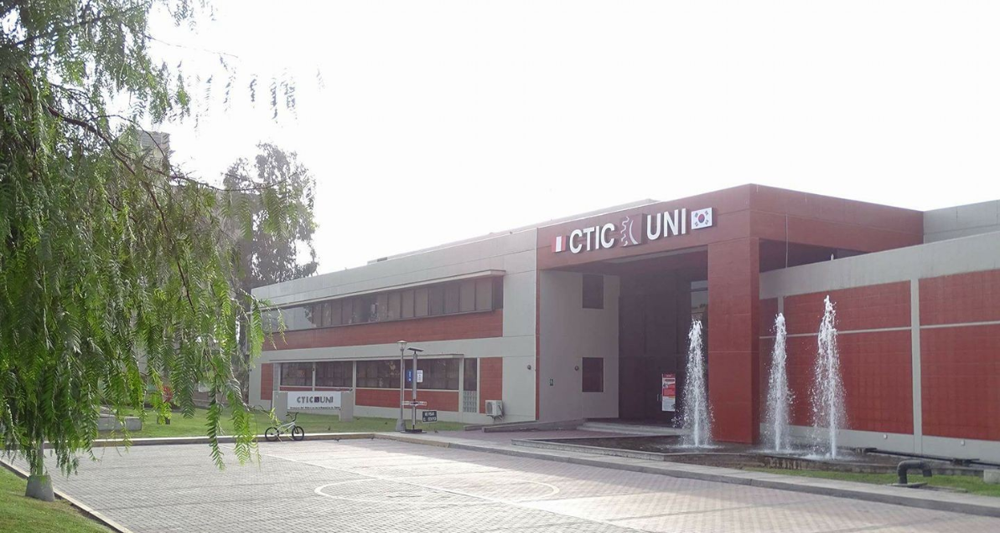

# Fundamentos de Programación en Matlab/Simulink - OTI - UNI 

El presente curso es una forma de llevar la capacitación que reciben
todos los estudiantes de la UNIVERSIDAD NACIONAL DE INGENIERIA
por parte de la Oficina de Tecnologías de la Información. Este curso
busca dotar a los participantes de las capacidades básicas
necesarias para el uso de software de alto nivel MATLAB/Simulink.

## Información general 
- *Modalidad virtual*
- *Duración de 8 sesiones*
- *16 horas*

## ¿Qué aprenderas en el curso?
Al finalizar el curso, tendrás los conocimientos para escribir
códigos en entorno MATLAB/Simulink de modelos matemáticos
que podrá ser usado en artículos científicos, informes de
laboratorio, reportes, tesis y demás documentos similares usados
en actividades académicos y/o laborales.

## Dirigido a 
Este curso está dirigido a alumnos de pregrado de todas las universidades.

## Temario del curso 

### Sesión 1.- LATEX PRIMEROS PASOS
- *1.- MATLAB Online. Explicación. Creación de usuario.*
- *2.- Fundamentos de programación de MATLAB/Simulink*
- *3.- Operaciones básicas: suma, resta, multiplicación, división.*
- *4.- Vectores. Comando colon (:).*
- *5.- Funciones.*

### Sesión 2.- GRÁFICAS BIDIMENSIONALES
- *1.- Scripts.*
- *2.- Vectores, funciones y gráficas bidimensionales.*
- *3.- Comandos:plot, axis, xlabel, ylabel, title, subplot, grid, legend.*

### Sesión 3.- GRÁFICAS TRIDIMENSIONALES
- *1.- Matrices y gráficas tridimensionales.*
- *2.- Ejes coordenados y creación de plano cartesiano.*
- *3.- Comandos: meshgrid, mesh.*

### Sesión 4.- FUNCTIONS
- *1.- Definición y sintaxis de functions.*
- *2.- Conversión de scripts a functions.*

### Sesión 5.- BLUCE FOR-END
- *1.- Definición y sintaxis.*
- *2.- Sumatorias.*

### Sesión 6.- BUCLE IF-ELSE-END
- *1.- Creación de números alteatorios. Comando rand.*
- *2.- Definición y sintaxis if-else-end.*

### Sesión 7.- EXCEL Y MATLAB
- *1.- Creación de scripts para trabajo Excel - MATLAB.*

### Sesión 8.- SIMULINK Y ECUACIONES DIFERENCIALES
- *1.- Repaso de ecuaciones diferenciales.*
- *2.- Presentación de Simulink.*
- *3.- Escritura de ecuaciones diferenciales en Simulink.*

## Docente 
*Jorge Luis Mírez Tarrillo* 

Ingeniero Mecánico Electricista por la Universidad Nacional Pedro Ruíz
Gallo de Lambayeque, Perú. Maestro en Ciencias y Doctor en Ciencias
con mención en Física por la Universidad Nacional de Ingeniería (UNI)
en Lima, Perú. Investigador RENACYT. Docente Investigador, Docente
en Facultad de Ingeniería de Petróleo, Gas Natural y Petroquímica,
Líder del Group of Mathematical Modeling and Numerical Simulation
(GMMNS)dela UniversidadNacionaldeIngeniería(UNI).

